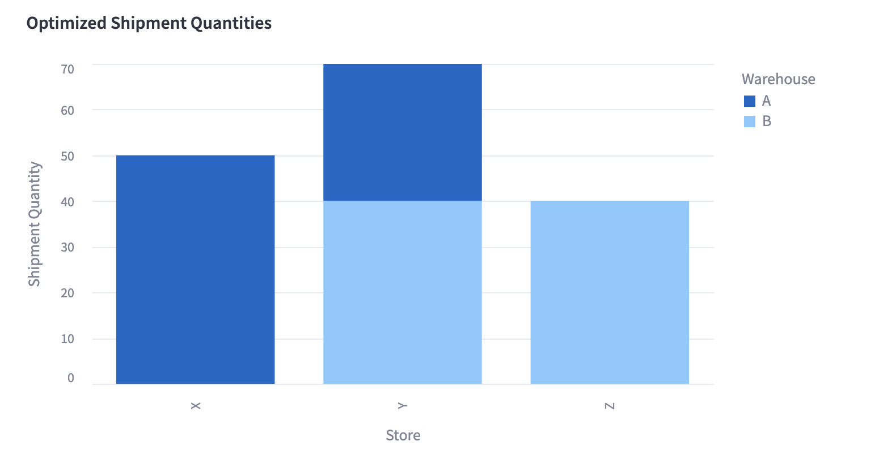
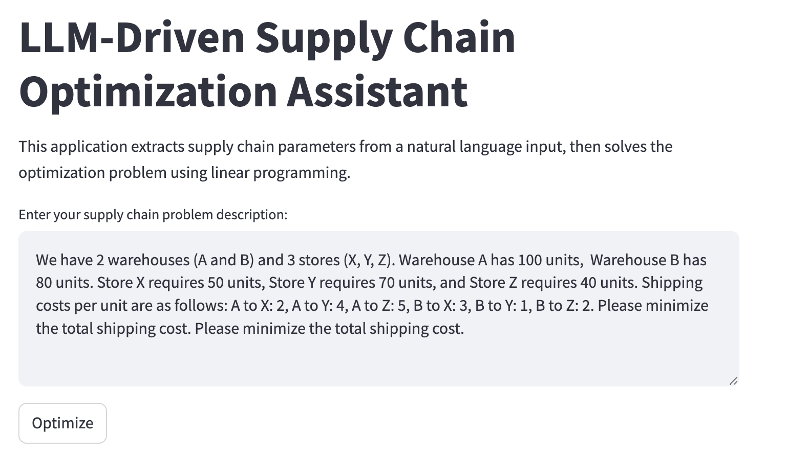

# LLM-Driven Supply Chain Optimization Assistant: Project Report

**Author:** Gaozhe Jiang (e0945601@u.nus.edu)  
**Date:** *{21 Feb 2025}*

---

## Table of Contents

1. [Project Title and Team Members](#project-title-and-team-members)
2. [Problem Statement](#problem-statement)
3. [Solution Approach](#solution-approach)
   - [Key Components](#key-components)
   - [System Architecture Overview](#system-architecture-overview)
4. [Instructions: How to Run the Code](#instructions-how-to-run-the-code)
   - [Prerequisites](#prerequisites)
   - [Environment Setup](#environment-setup)
   - [Configuration](#configuration)
   - [Running the Application](#running-the-application)
5. [Results](#results)
   - [Natural Language Parsing (Simulated)](#natural-language-parsing-simulated)
   - [Optimization of the Transportation Problem](#optimization-of-the-transportation-problem)
   - [Interactive User Interface](#interactive-user-interface)
   - [Sample Optimization Results](#sample-optimization-results)
   - [Figures](#figures)
6. [Future Work](#future-work)
7. [Code Organization](#code-organization)
8. [License](#license)

---

## Project Title and Team Members

- **Project Title:** LLM-Driven Supply Chain Optimization Assistant
- **Team Member:**  
  - Gaozhe Jiang (e0945601@u.nus.edu)

---

## Problem Statement

Efficient supply chain management is a critical driver for operational success in modern businesses. Even minor inefficiencies in planning, resource allocation, and logistics can lead to significant cost overruns, delivery delays, and overall operational disruptions. Many companies struggle to formulate and solve the complex optimization problems required to streamline these processes—especially when decision-makers lack deep expertise in operations research (OR).

**The Challenge:**  
Develop an intelligent system that allows users to describe their supply chain problems in plain, natural language. The system automatically extracts key parameters and formulates a corresponding optimization model to compute an optimal shipment plan. By bridging the gap between natural language and mathematical optimization, the system aims to democratize advanced analytical methods.

**Importance:**

- **Accessibility:** Enables business managers and analysts to leverage advanced OR without needing extensive technical training.
- **Efficiency:** Automates the translation from natural language descriptions to mathematical models, saving time and reducing errors.
- **Cost Savings:** Optimizes resource allocation to minimize shipping and transportation costs.
- **Scalability:** Establishes a scalable foundation for tackling more complex supply chain challenges in the future.

---

## Solution Approach

Our solution integrates modern Large Language Model (LLM) techniques with classical optimization methods using a modular, agent-based architecture.

### Key Components

1. **Natural Language Parsing with LLMs:**
   - We simulate an LLM parser that converts natural language descriptions into structured data by extracting key parameters such as warehouse names, store names, available supply, demand requirements, and shipping costs.
   - *Future Enhancement:* Upgrade this module using frameworks like `LangChain` or `DSPy` and live API calls (e.g., OpenAI’s GPT-4) to dynamically process user inputs.

2. **Optimization Module:**
   - The extracted parameters are used to formulate a transportation problem as a linear programming (LP) model.
   - We utilize `PuLP`, a Python library for LP, to construct and solve the optimization model. The objective is to minimize the total shipping cost while satisfying supply and demand constraints.

3. **Interactive Web Interface:**
   - A `Streamlit` web application serves as the user interface, allowing users to input a natural language description of their supply chain problem and view the parsed parameters and optimization results in a clear, interactive format.

### System Architecture Overview

   +----------------------------+
   | User Input (Natural      |
   | Language Description)    |
   +-------------+--------------+
                 |
                 v
   +-----------------------------+
   | LLM Parser (Simulated or    |
   | Live via LangChain/OpenAI)  |
   +-------------+---------------+
                 |
                 v
   +---------------------------------------+
   | Data Extraction & Parameter Formation |
   | (Warehouses, Stores, Supply, Demand,   |
   | Shipping Costs)                        |
   +----------------+------------------------+
                 |
                 v
   +--------------------------------------+
   | Optimization Module (PuLP)           |
   | (Formulate & Solve Transportation LP)|
   +----------------+-----------------------+
                 |
                 v
   +-----------------------------+
   | Streamlit Web Interface     |
   | (Display Results &         |
   | Explanation)                |
   +-----------------------------+

**Figure 1:** System Architecture Diagram

*Note: The current prototype uses fixed example data to simulate LLM output. Future iterations will incorporate live LLM parsing.*

---

## Instructions: How to Run the Code

### Prerequisites

- **Python 3.8+** is required. Verify your version by running:
- (Optional) **OpenAI API Key:**  
If you plan to integrate a live LLM for parsing, obtain an API key from OpenAI and set it as an environment variable (`OPENAI_API_KEY`).

### Environment Setup

1. **Clone the Repository:**
git clone https://github.com/yourusername/LLM-SupplyChain-Optimization.git cd LLM-SupplyChain-Optimization


2. **Create and Activate a Virtual Environment:**
- On macOS/Linux:
  ```
  python -m venv venv
  source venv/bin/activate
  ```
- On Windows:
  ```
  python -m venv venv
  venv\Scripts\activate
  ```

3. **Install Dependencies:**  
The dependencies are listed in `requirements.txt`. Install them using:


### Configuration

- (Optional) Set your OpenAI API key if you plan to use live LLM parsing:
- On macOS/Linux:
 ```
 export OPENAI_API_KEY=your_openai_api_key
 ```
- On Windows:
 ```
 set OPENAI_API_KEY=your_openai_api_key
 ```

### Running the Application

1. **Start the Streamlit Application:**
2. **Using the Application:**
- A browser window will open displaying the application interface.
- Enter a natural language description of your supply chain problem into the text area.
- **Example Input:**
  ```
  "We have 2 warehouses (A and B) and 3 stores (X, Y, Z). Warehouse A has 100 units,
  Warehouse B has 80 units. Store X requires 50 units, Store Y requires 70 units, and 
  Store Z requires 40 units. Shipping costs per unit are as follows: A to X: 2, A to Y: 4,
  A to Z: 5, B to X: 3, B to Y: 1, B to Z: 2. Please minimize the total shipping cost."
  ```
- Click the **Optimize** button.
- The application will display:
  - The parsed parameters (warehouses, stores, supply, demand, shipping costs).
  - An explanation of the parsing process.
  - The optimized shipment plan along with the total shipping cost.

---

## Results

The current prototype demonstrates several key capabilities:

### Natural Language Parsing (Simulated)
- The system simulates an LLM-based parser that extracts essential supply chain details from a natural language input.
- Although the current implementation uses fixed example data, it reflects the expected structure for a real-world scenario.

### Optimization of the Transportation Problem
- Using `PuLP`, the system formulates a linear programming model that minimizes the total shipping cost while ensuring:
- Shipments from each warehouse do not exceed available inventory.
- Each store receives at least its required quantity.

### Interactive User Interface
- The `Streamlit` web app offers an intuitive interface for inputting the supply chain problem description and viewing the optimization results.
- Users can immediately see the parsed data and a detailed shipment plan.

### Sample Optimization Results

**Optimization Results (Example):**  
- **Status:** Optimal  
- **Total Shipping Cost:** 340.0  
- **Shipment Plan:**
- From Warehouse A to Store X: 50.0 units
- From Warehouse A to Store Y: 30.0 units
- From Warehouse A to Store Z: 0.0 units
- From Warehouse B to Store X: 0.0 units
- From Warehouse B to Store Y: 40.0 units
- From Warehouse B to Store Z: 40.0 units

### Figures

  
*Figure 2: Sample Plot of Optimized Shipment Quantities*

  
*Figure 3: Screenshot of the Streamlit User Interface*

---

## Future Work

To extend and improve the system beyond the hackathon, our planned enhancements include:

1. **Integrate Live LLM Parsing:**  
Replace the simulated parser with a live integration using `LangChain` and the OpenAI API to dynamically extract parameters from natural language inputs.

2. **Enhance the Optimization Model:**  
Extend the current transportation model to handle more complex scenarios such as multi-modal transportation, dynamic inventory management, and incorporating uncertainty in supply/demand.

3. **Improve the User Interface:**  
Upgrade the `Streamlit` app with interactive visualizations (e.g., dynamic charts, graphs), detailed explanations of the optimization process, and robust error handling.

4. **Incorporate External Data Sources:**  
Connect the system to real-time data APIs or databases to automatically update model parameters and improve decision accuracy.

5. **Advanced Agentic Orchestration:**  
Explore additional frameworks such as `LangGraph` and `DSPy` to manage multi-agent interactions and orchestrate more sophisticated workflows.

---

## Code Organization

The repository is organized as follows:

LLM-SupplyChain-Optimization/ ├── README.md // This Markdown project report ├── requirements.txt // List of Python dependencies └── app.py // Main application code (Streamlit web app)

Each section of the code is well-commented and organized for clarity and ease of maintenance.

---

## License

This project is licensed under the MIT License. See the LICENSE file for details.
